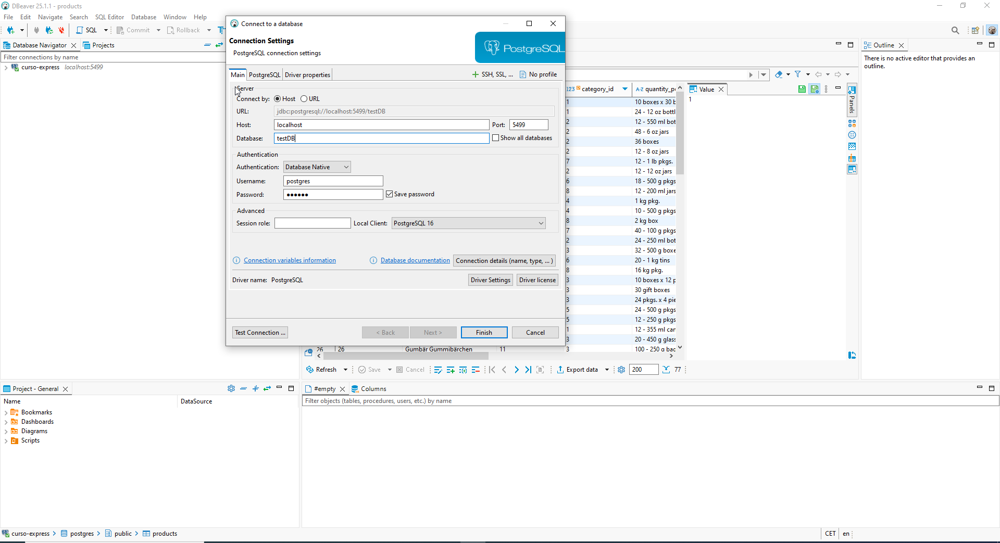
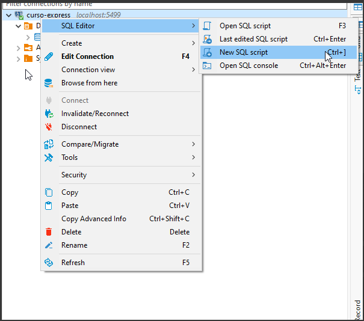
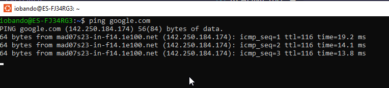
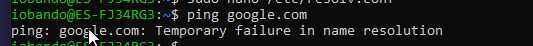
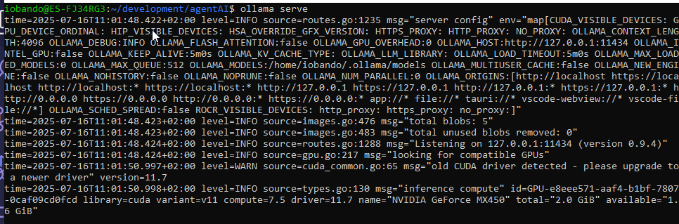
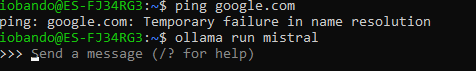

# 🧠 Offline LLM with PostgreSQL - Full Setup Guide

This guide walks you through creating a PostgreSQL test database, installing a local LLM runtime (Ollama with Mistral), setting up a Python environment, and ensuring everything works **offline**.

---

## 1️⃣ Create the PostgreSQL Database

Start the container:

```bash
docker run -p 5499:5432 -e POSTGRES_PASSWORD=123456 --name testDB postgres
```

Then, connect with any DB manager (e.g., DBeaver, pgAdmin):

- **Host:** `localhost`
- **Port:** `5499`
- **User:** `postgres`
- **Password:** `123456`

📸 **Image 1**: Connection to DB  


---

## 2️⃣ Load the Northwind Schema

Inside the new connection, open a script editor:

📸 **Image 2**: Open script
`

Then download the SQL file and run it:

```text
https://github.com/pthom/northwind_psql
```

This creates a **supply chain example DB**.

---

## 3️⃣ Install the Ollama Runtime

Run:

```bash
curl -fsSL https://ollama.com/install.sh | sh
```

Test the installation:

```bash
ollama --version
```

---

## 4️⃣ Set Up Python Environment

Create and activate a virtual environment:

```bash
python -m venv venv
source venv/bin/activate
```

Install required packages:

```bash
pip install langchain langchain-community psycopg2-binary
```

---

## 5️⃣ Cut the Internet Connection in WSL

Test internet access:

```bash
ping google.com
```

📸 **Image 3**: Successful ping
`

Now, disable DNS access in WSL:

```bash
sudo chattr -i /etc/resolv.conf
sudo nano /etc/resolv.conf
```

Inside the file, replace contents with:

```
nameserver 127.0.0.1
```

Save (`Ctrl+O`, `Enter`, `Ctrl+X`) and lock:

```bash
sudo chattr +i /etc/resolv.conf
```

Test again:

```bash
ping google.com
```

📸 **Image 4**: Ping blocked
`

---

## 6️⃣ Launch Ollama Runtime (Offline)

Start the runtime:

```bash
ollama serve
```

📸 **Image 5**: Runtime running
`

---

## 7️⃣ Run Mistral Model

```bash
ollama run mistral
```

📸 **Image 6**: Mistral loaded
`

---

## 8️⃣ Run Your Python Script

```bash
python index.py
```

🎉 You’re running your app **fully offline** with a **local LLM** and a **PostgreSQL DB**!

---
